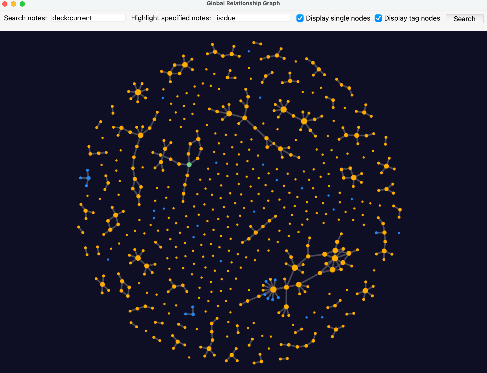
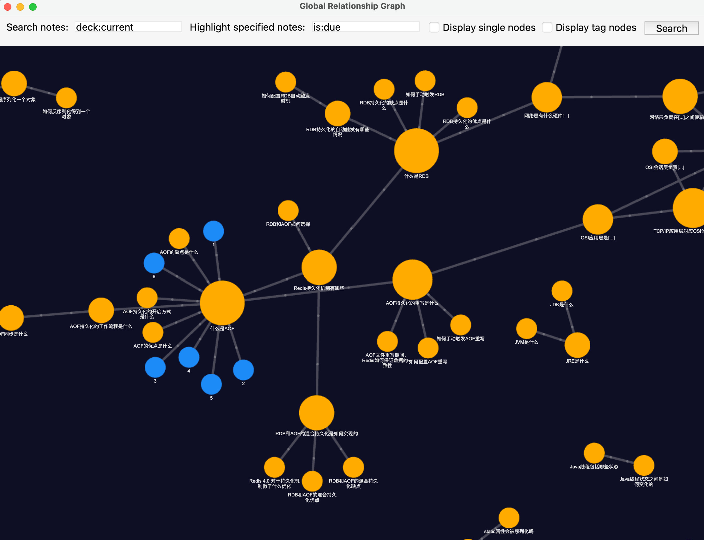
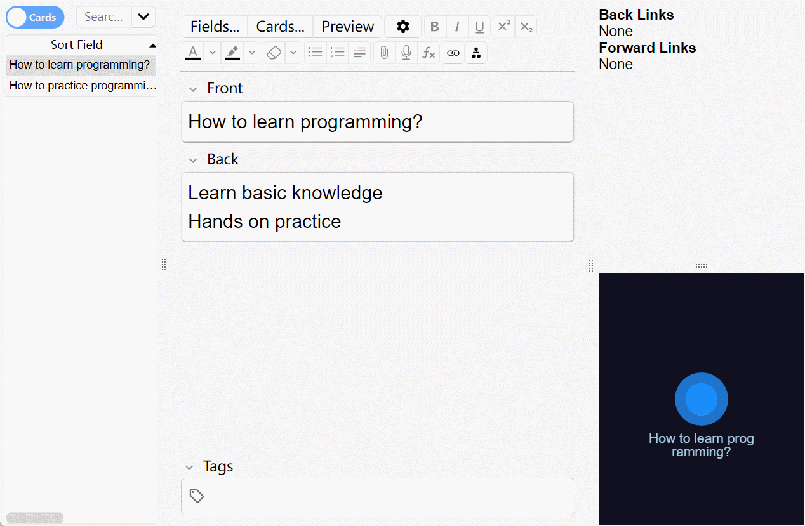

**[English](README.md) | 简体中文**

# Anki 笔记链接器

[在 AnkiWeb 中查看](https://ankiweb.net/shared/info/1077002392)







您可以通过这个插件轻松地将您的Anki笔记连接在一起，形成一个相互连接的信息网络。
通过在相关笔记之间建立链接，您可以创建一个全面而有组织的知识库，反映各种概念，想法和主题之间的关系。

**注意：此插件尚未在低于`23.12.1`的Anki版本上进行充分测试，可能无法在这些版本中正常工作**

## 链接格式

`[链接标题|nidxxxxxxxxxxxxx]`

链接标题是在卡片中显示的内容。如果标题包含`[`，则需要使用`\[`进行转义

`x`是笔记的ID，由13位数字组成

## 使用方法

### 在编辑器中:

#### 复制笔记ID

使用右键菜单或按`Alt+Shift+C`复制编辑器中当前笔记的ID

#### 复制笔记链接

使用右键菜单或按`Alt+Shift+L`复制编辑器中当前笔记的链接

#### 插入带有已复制的笔记ID的链接

使用右键菜单或按`Alt+Shift+V`从剪贴板中的笔记ID和当前选定的文本生成链接

>旧版本中的`Alt+l`快捷键仍然可以使用，但在未来版本中将被移除。您可以在插件配置中自定义快捷键

#### 插入新链接（用于添加笔记）

通过使用右键单击菜单或按下`Alt+Shift+N`从当前选定的文本生成新链接

双击生成的链接可以添加相应的新笔记

>旧版本中的`Alt+k`快捷键仍然可以使用，但在未来版本中将被移除。您可以在插件配置中自定义快捷键

#### 插入链接模板

使用右键单击菜单或按`Alt+Shift+T`从当前选定的文本生成链接模板

生成的链接模板看起来是这样：`[选定的文本|nid]`，您需要手动补充笔记ID来完成它

>旧版本中的`Alt+j`快捷键仍然可以使用，但在未来版本中将被移除。您可以在插件配置中自定义快捷键

_备注: 如果没有选中文本，使用上述操作将生成一个没有标题的链接_

#### 在新窗口中打开当前笔记

使用右键菜单或按`Alt+Shift+W`在新窗口中打开当前笔记

#### 在新窗口中打开链接对应的笔记

`双击链接`在新窗口中打开对应的笔记

### 在‘链接面板/关系图面板’中:

`左键单击链接`在当前窗口中打开对应的笔记

`右键单击链接`在新窗口中打开对应的笔记

`中键（滚轮）单击链接`在浏览器界面中打开对应的笔记（在关系图中不支持）

### 在‘复习页面/预览页面/全局关系图’中:

`左键单击链接`在编辑器窗口中打开对应的笔记

`右键单击链接`在预览器窗口中打开对应的笔记

### 全局关系图（实验性）

入口: `菜单 -> 工具 -> 全局关系图（实验性）`

请将Anki首选项中的视频驱动程序设置为`Software`以外的选项，因为它会显著降低图形性能

### 自定义快捷键

您可以根据自己的喜好在插件配置中自定义快捷键

如果使用快捷键时没有响应，则可能是由于快捷键冲突，请尝试更改快捷键

---
## 如何在没有此插件的情况下正确显示笔记（如AnkiDroid）

此插件会自动将笔记链接转换为卡片中显示的相应内容。但是，如果没有此插件，链接将不会被转换，例如在AnkiDroid中。

如果您已经生成了笔记链接，并且需要在没有此插件的情况下使用，则可以将以下代码添加到卡片模板中。它会在没有这个插件的情况下自动呈现正确的笔记内容。

```html
<script>
    requestIdleCallback(() => {
        try { AnkiNoteLinkerIsActive } catch (e) {
            document.documentElement.innerHTML = document.documentElement.innerHTML
                .replace(/\[((?:[^\[]|\\\[)*?)\|nid\d{13}\]/g, (match, title) => title.replace(/\\\[/g, '['))
        }
    })
</script>
```

---
本插件创作灵感来源于 [Obsidian](https://obsidian.md/)

本项目中使用到了以下项目：

- [Force graph](https://github.com/vasturiano/force-graph)

- [d3](https://github.com/d3/d3)

此插件的实现受到以下插件的启发：

- [link Cards Notes and Preview them in extra window](https://ankiweb.net/shared/info/1423933177)

- [hjp-linkmaster](https://ankiweb.net/shared/info/1420819673)

- [Editor Live Preview](https://ankiweb.net/shared/info/1960039667)

---
插件代码：1077002392